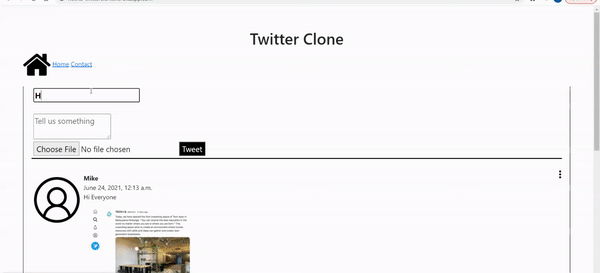

# twitter_clone

An application that would be able to view create and delete the posts done by the user . 
The application is able to track the like counts and also able to update the posts  .

## Installation  and run

* Clone the repository to your local machine
* Run python manage.py runserver  

## Technologies Used
* Html
* Css
* Bootstrap
* Javascript / JQuery
* Django
* Cloudinary (To host uploaded images on CDN)
* Heroku

## Demo 
Check out [LIVE DEMO](https://heena-twitterclone.herokuapp.com/) here!!
